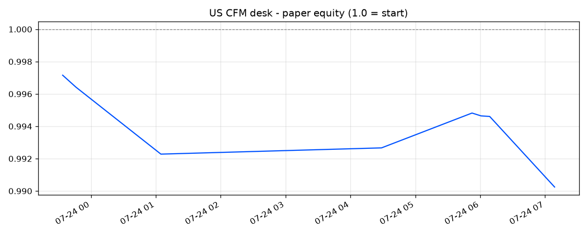

# US CFM Desk - Paper-Trading Status

*Coinbase CFTC-regulated perp-style futures (CDE), paper-traded at a
$10,000 account with whole-contract rounding, posted hourly funding,
taker fees + slippage + per-contract commission floor. Simulated - no real
money. Book: slow momentum 60% / funding carry 40% (see cfm_backtest.py).*

| | |
|---|---|
| **Equity** | **0.9902** (-0.98% since start) |
| Peak / drawdown | 1.0000 / -0.98% |
| Ticks recorded | 8 |
| Last tick | 2026-07-24T07:08:46.834872+00:00 (-0.4385%) |
| Risk rails | normal (dd -0.5%) |
| Data source | coinbase-cfm (bar 2026-07-24 06:00:00+00:00) |
| Gross leverage | 2.46x |

## Positions (weight of account / whole contracts)

| Long | Size | Contracts |
|---|---|---|
| AAVE perp | +24.2% | +5 |
| BCH perp | +17.1% | +8 |
| HBAR perp | +14.3% | +4 |
| ETH perp | +13.3% | +7 |
| ADA perp | +11.8% | +7 |
| SOL perp | +7.6% | +2 |

| Short | Size | Contracts |
|---|---|---|
| DOGE perp | -35.0% | -10 |
| SUI perp | -22.4% | -6 |
| LTC perp | -18.9% | -8 |
| SHIB perp | -18.0% | -43 |
| LINK perp | -12.8% | -3 |
| BNB perp | -11.4% | -2 |
| XRP perp | -11.2% | -2 |
| NEAR perp | -9.6% | -1 |
| BTC perp | -6.6% | -1 |
| ENA perp | -4.6% | -1 |
| AVAX perp | -3.8% | -6 |
| PEPE perp | -2.8% | -1 |
| DOT perp | -0.8% | -1 |

*Every position is an integer number of CDE contracts at the configured
account size - exactly what a live account could hold.*
