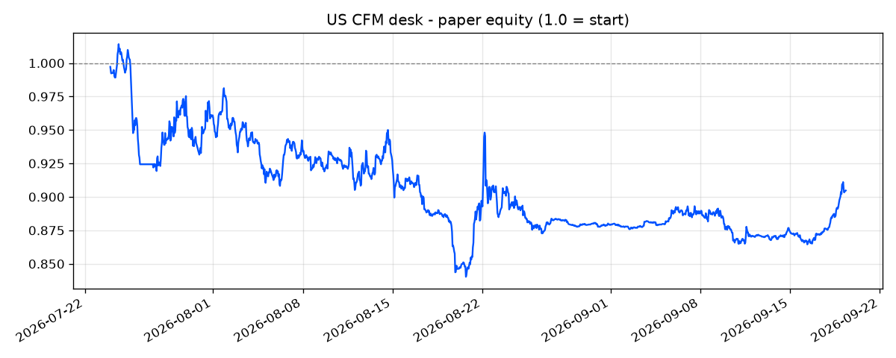

# US CFM Desk - Paper-Trading Status

*Coinbase CFTC-regulated perp-style futures (CDE), paper-traded at a
$10,000 account with whole-contract rounding, posted hourly funding,
taker fees + slippage + per-contract commission floor. Simulated - no real
money. Book: slow momentum 60% / funding carry 40% (see cfm_backtest.py).*

| | |
|---|---|
| **Equity** | **0.8872** (-11.28% since start) |
| Peak / drawdown | 1.0141 / -12.52% |
| Ticks recorded | 1067 |
| Last tick | 2026-09-06T19:08:12.027611+00:00 (-0.0373%) |
| Risk rails | brake: drawdown -12.5% <= -12%, half size |
| Data source | coinbase-cfm (bar 2026-09-06 18:00:00+00:00) |
| Gross leverage | 0.36x |
| Weeks tracked | 6 |
| Average week | -0.67% |
| Weeks >= +3% | 0% |
| Best / worst week | +1.74% / -2.88% |

## Positions (weight of account / whole contracts)

| Long | Size | Contracts |
|---|---|---|
| AAVE perp | +7.5% | +1 |
| SOL perp | +6.0% | +1 |
| AVAX perp | +5.2% | +6 |
| DOGE perp | +5.0% | +1 |
| LTC perp | +3.1% | +1 |
| BCH perp | +2.9% | +1 |
| ETH perp | +2.8% | +1 |
| ADA perp | +2.5% | +1 |
| DOT perp | +1.1% | +1 |

| Short | Size | Contracts |
|---|---|---|
| (none) | | |

*Every position is an integer number of CDE contracts at the configured
account size - exactly what a live account could hold.*
