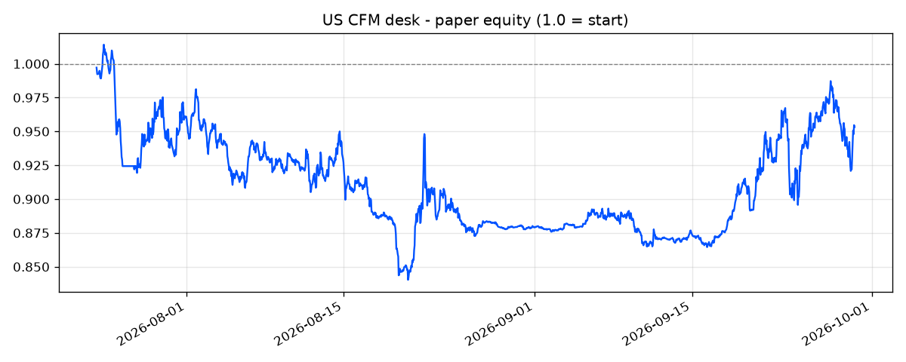

# US CFM Desk - Paper-Trading Status

*Coinbase CFTC-regulated perp-style futures (CDE), paper-traded at a
$10,000 account with whole-contract rounding, posted hourly funding,
taker fees + slippage + per-contract commission floor. Simulated - no real
money. Book: slow momentum 60% / funding carry 40% (see cfm_backtest.py).*

| | |
|---|---|
| **Equity** | **0.9555** (-4.45% since start) |
| Peak / drawdown | 1.0141 / -5.78% |
| Ticks recorded | 1577 |
| Last tick | 2026-09-28T05:08:26.002257+00:00 (-0.0222%) |
| Risk rails | normal (dd -5.8%) |
| Data source | coinbase-cfm (bar 2026-09-28 04:00:00+00:00) |
| Gross leverage | 0.88x |
| Weeks tracked | 10 |
| Average week | +0.37% |
| Weeks >= +3% | 20% |
| Best / worst week | +5.83% / -2.88% |

## Positions (weight of account / whole contracts)

| Long | Size | Contracts |
|---|---|---|
| ZEC perp | +16.3% | +1 |
| DOT perp | +11.7% | +9 |
| ETH perp | +11.1% | +4 |
| BTC perp | +8.7% | +1 |
| AAVE perp | +7.9% | +1 |
| AVAX perp | +7.8% | +7 |
| BCH perp | +6.6% | +2 |
| SOL perp | +6.3% | +1 |
| LTC perp | +3.7% | +1 |

| Short | Size | Contracts |
|---|---|---|
| DOGE perp | -4.9% | -1 |
| ADA perp | -2.6% | -1 |

*Every position is an integer number of CDE contracts at the configured
account size - exactly what a live account could hold.*
