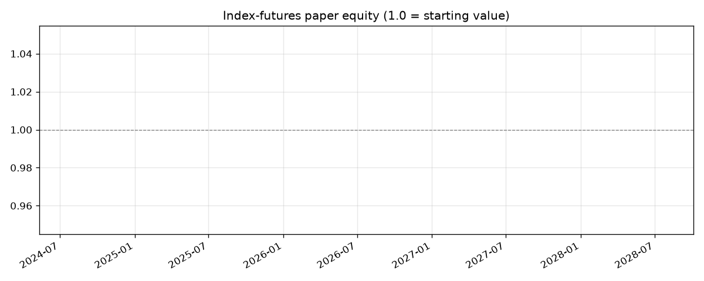

# Index-Futures Paper-Trading Status

*Auto-updated daily. Equity is a multiplier of starting value (simulated —
no real money). Weights map to MES/MNQ/MYM/M2K micro index futures;
decisions at the close fill at the next session's open, net of 1.5bp
turnover cost and T-bill financing.*

| | |
|---|---|
| **Equity** | **0.9998** (-0.02% since start) |
| Peak / drawdown | 1.0000 / -0.02% |
| Fills recorded | 1 |
| Last fill | 2026-07-23 (-0.0155%) |
| Pending order | none |
| Risk rails | normal (dd +0.0%) |
| Gross leverage | 1.04x |

## Positions (fraction of account, futures-notional)

| Long | Size |
|---|---|
| MES (SPY) | +37.2% |
| MYM (DIA) | +26.1% |
| M2K (IWM) | +20.7% |
| MNQ (QQQ) | +19.5% |

| Short | Size |
|---|---|
| (none) | |
