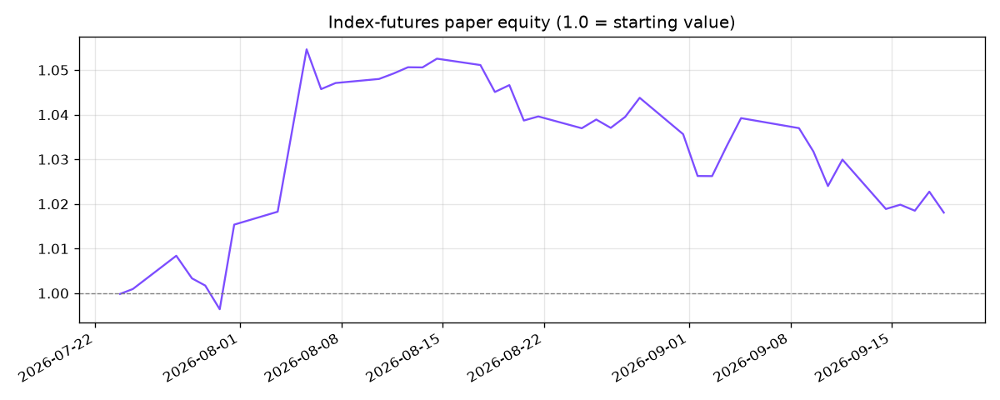

# Index-Futures Paper-Trading Status

*Auto-updated daily. Equity is a multiplier of starting value (simulated —
no real money). Weights map to MES/MNQ/MYM/M2K micro index futures;
decisions at the close fill at the next session's open, net of 1.5bp
turnover cost and T-bill financing.*

| | |
|---|---|
| **Equity** | **1.0370** (+3.70% since start) |
| Peak / drawdown | 1.0546 / -1.67% |
| Fills recorded | 25 |
| Last fill | 2026-08-26 (-0.1796%) |
| Pending order | 2026-08-26 |
| Risk rails | normal (dd -1.5%) |
| Gross leverage | 0.67x |
| Weeks tracked | 5 |
| Average week | +0.72% |
| Weeks ≥ +3% | 20% |
| Best / worst week | +3.12% / -1.23% |

## Positions (fraction of account, futures-notional)

| Long | Size |
|---|---|
| MES (SPY) | +24.9% |
| MYM (DIA) | +14.2% |
| MNQ (QQQ) | +14.2% |
| M2K (IWM) | +13.3% |

| Short | Size |
|---|---|
| (none) | |
