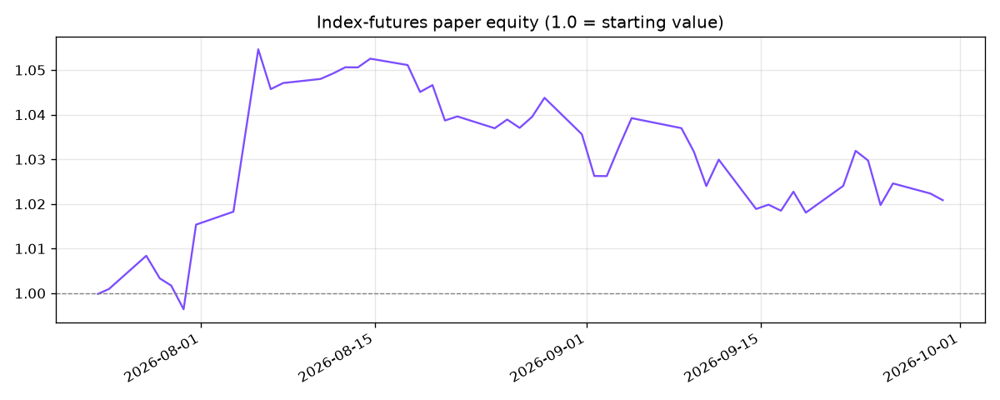

# Index-Futures Paper-Trading Status

*Auto-updated daily. Equity is a multiplier of starting value (simulated —
no real money). Weights map to MES/MNQ/MYM/M2K micro index futures;
decisions at the close fill at the next session's open, net of 1.5bp
turnover cost and T-bill financing.*

| | |
|---|---|
| **Equity** | **1.0144** (+1.44% since start) |
| Peak / drawdown | 1.0546 / -3.82% |
| Fills recorded | 50 |
| Last fill | 2026-10-01 (-0.5938%) |
| Pending order | none |
| Risk rails | normal (dd -3.2%) |
| Gross leverage | 1.39x |
| Weeks tracked | 10 |
| Average week | +0.14% |
| Weeks ≥ +3% | 10% |
| Best / worst week | +3.12% / -1.23% |

## Positions (fraction of account, futures-notional)

| Long | Size |
|---|---|
| MES (SPY) | +45.1% |
| M2K (IWM) | +42.7% |
| MNQ (QQQ) | +27.5% |
| MYM (DIA) | +24.1% |

| Short | Size |
|---|---|
| (none) | |
