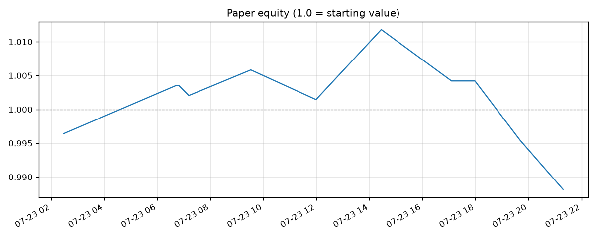

# Paper-Trading Status

*Auto-updated by each hourly tick. Equity is a multiplier of starting value
(simulated — no real money). All returns net of taker fees, tiered slippage,
and 8h funding settlements.*

| | |
|---|---|
| **Equity** | **0.9882** (-1.18% since start) |
| Peak / drawdown | 1.0118 / -2.33% |
| Ticks recorded | 12 |
| Last tick | 2026-07-23T21:18:38.355498+00:00 (-0.7286%) |
| Risk rails | normal (dd -1.6%) |
| Data source | okx (bar 2026-07-23 20:00:00+00:00) |
| Gross leverage | 3.46x |

## Positions (futures contracts, fraction of account)

**Long perps** | **Short perps**

| Contract | Size |
|---|---|
| ATOM perp | +46.6% |
| TRX perp | +25.4% |
| ETH perp | +18.4% |
| AAVE perp | +18.1% |
| BCH perp | +15.5% |
| SOL perp | +10.2% |
| UNI perp | +3.2% |
| ALGO perp | +2.7% |

| Contract | Size |
|---|---|
| DOGE perp | -41.0% |
| LTC perp | -39.1% |
| SUSHI perp | -27.7% |
| FIL perp | -18.0% |
| XRP perp | -13.3% |
| THETA perp | -13.1% |
| LINK perp | -12.4% |
| ETC perp | -11.4% |
| XLM perp | -10.0% |
| BTC perp | -6.8% |
| AVAX perp | -5.3% |
| BNB perp | -4.1% |
| ADA perp | -3.9% |

*Longs collect when price rises; shorts collect when price falls. The book is
mostly market-neutral: it earns funding spread + momentum, not a bet that
crypto goes up.*
