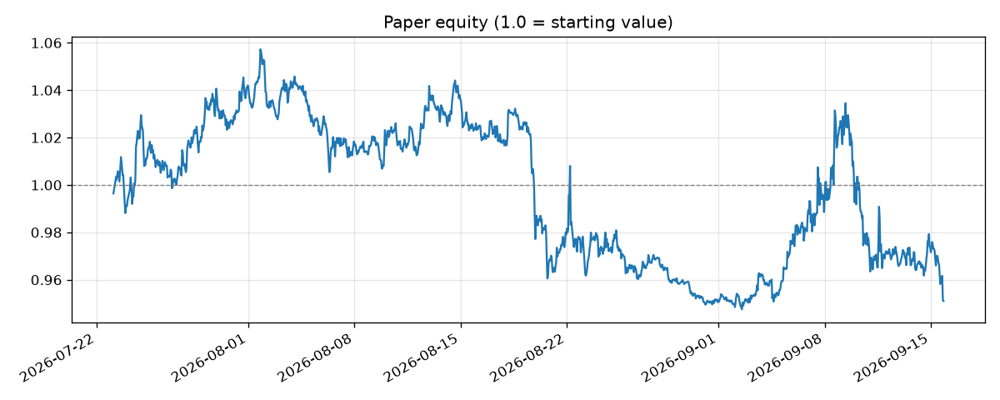

# Paper-Trading Status

*Auto-updated by each hourly tick. Equity is a multiplier of starting value
(simulated — no real money). All returns net of taker fees, tiered slippage,
and 8h funding settlements.*

| | |
|---|---|
| **Equity** | **0.9765** (-2.35% since start) |
| Peak / drawdown | 1.0572 / -7.64% |
| Ticks recorded | 1079 |
| Last tick | 2026-09-06T15:08:03.463744+00:00 (-0.6091%) |
| Risk rails | normal (dd -7.6%) |
| Data source | okx (bar 2026-09-06 14:00:00+00:00) |
| Gross leverage | 1.01x |
| Weeks tracked | 6 |
| Average week | -0.33% |
| Weeks ≥ +3% | 17% |
| Best / worst week | +3.03% / -4.65% |

## Positions (futures contracts, fraction of account)

**Long perps** | **Short perps**

| Contract | Size |
|---|---|
| TRX perp | +19.1% |
| ALGO perp | +11.3% |
| SOL perp | +8.8% |
| FIL perp | +8.6% |
| ATOM perp | +7.7% |
| ETC perp | +6.7% |
| AVAX perp | +5.8% |
| AAVE perp | +5.8% |
| BTC perp | +5.7% |
| DOGE perp | +4.5% |
| DOT perp | +2.5% |
| BNB perp | +1.7% |
| LTC perp | +1.6% |
| BCH perp | +1.3% |
| LINK perp | +1.3% |
| ETH perp | +1.1% |
| THETA perp | +0.9% |
| ADA perp | +0.9% |
| XRP perp | +0.8% |
| UNI perp | +0.7% |

| Contract | Size |
|---|---|
| XLM perp | -4.7% |

*Longs collect when price rises; shorts collect when price falls. The book is
mostly market-neutral: it earns funding spread + momentum, not a bet that
crypto goes up.*
