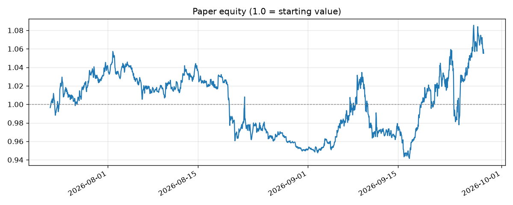

# Paper-Trading Status

*Auto-updated by each hourly tick. Equity is a multiplier of starting value
(simulated — no real money). All returns net of taker fees, tiered slippage,
and 8h funding settlements.*

| | |
|---|---|
| **Equity** | **1.0614** (+6.14% since start) |
| Peak / drawdown | 1.0855 / -2.22% |
| Ticks recorded | 1572 |
| Last tick | 2026-09-27T04:08:04.845142+00:00 (-0.1561%) |
| Risk rails | normal (dd -2.2%) |
| Data source | okx (bar 2026-09-27 03:00:00+00:00) |
| Gross leverage | 1.29x |
| Weeks tracked | 9 |
| Average week | +0.74% |
| Weeks ≥ +3% | 44% |
| Best / worst week | +5.60% / -4.65% |

## Positions (futures contracts, fraction of account)

**Long perps** | **Short perps**

| Contract | Size |
|---|---|
| TRX perp | +14.5% |
| ATOM perp | +13.9% |
| DOT perp | +12.3% |
| ETH perp | +9.9% |
| FIL perp | +9.6% |
| BCH perp | +8.0% |
| AVAX perp | +7.5% |
| SOL perp | +6.6% |
| AAVE perp | +5.8% |
| BTC perp | +4.7% |
| LTC perp | +2.8% |
| ETC perp | +2.5% |
| LINK perp | +2.4% |
| ADA perp | +1.5% |
| XLM perp | +1.5% |
| THETA perp | +1.4% |
| ALGO perp | +1.3% |
| SUSHI perp | +1.2% |
| UNI perp | +0.8% |

| Contract | Size |
|---|---|
| DOGE perp | -9.7% |
| XRP perp | -5.9% |
| BNB perp | -5.7% |

*Longs collect when price rises; shorts collect when price falls. The book is
mostly market-neutral: it earns funding spread + momentum, not a bet that
crypto goes up.*
